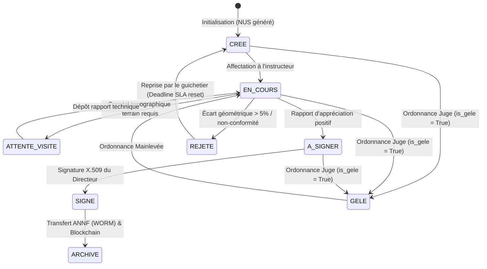

# 🔄 Machine d'États des Dossiers Administratifs (DOSSIER_STATES.md)

**République du Niger**  
*Ministère de l'Urbanisme, de l'Habitat et du Domaine Foncier*  
*Moteur d'États Foncier+ (Finite State Machine)*

---

## 🗺️ 1. Diagramme Général de Transition d'États

Le graphe ci-dessous illustre le cycle de vie légal et technique d'un dossier (demande CCFM, mutation, concession) au sein du moteur Foncier+ :

---

## 📋 2. Définitions Détaillées des États

### 📥 1. CREE (Créé / Initialisé)
*   **Signification** : Le dossier est enregistré par le guichetier communal. Les frais administratifs de traitement sont acquittés.
*   **Acteur Responsable** : `GUICHETIER_CCFM` / `AGENT_COMMUNE`.
*   **Effet Système** : Génération automatique du NUS (Numéro Unique de Scellement) et de la fiche de dossier vide en base de données.

### ⚙️ 2. EN_COURS (En cours d'instruction)
*   **Signification** : L'instructeur technique étudie la cohérence documentaire et géospatiale du dossier.
*   **Acteur Responsable** : `CHEF_CCFM` / `INGENIEUR_CADASTRE`.
*   **Effet Système** : Blocage d'écriture pour tout autre utilisateur (verrouillage pessimiste de la ressource).

### 📍 3. ATTENTE_VISITE (Attente de visite topographique)
*   **Signification** : Un levé contradictoire de bornage terrain est requis pour valider les coordonnées GPS.
*   **Acteur Responsable** : `TOPOGRAPHE_CCFM` / `GEOMETRE_CADASTRE`.
*   **Effet Système** : Enclenchement de la deadline de visite SLA.

### ✒️ 4. A_SIGNER (Prêt pour signature)
*   **Signification** : L'instruction technique est validée. Le rapport d'appréciation technique est généré et favorable.
*   **Acteur Responsable** : `CHEF_CCFM` (soumet au Directeur).
*   **Effet Système** : Notification envoyée au signataire habilité.

### 🖋️ 5. SIGNE (Signé électroniquement)
*   **Signification** : Le Directeur de l'Urbanisme ou le Conservateur a apposé sa signature numérique cryptographique X.509 sur l'acte.
*   **Acteur Responsable** : `DIRECTEUR_URBANISME` / `CONSERVATEUR_FONCIER`.
*   **Effet Système** : L'acte PDF officiel avec QR Code d'intégrité est généré et stocké sur MinIO.

### 🗄️ 6. ARCHIVE (Transféré à l'Archive Nationale)
*   **Signification** : L'acte signé est scellé cryptographiquement et déposé dans le registre WORM ANNF.
*   **Acteur Responsable** : `SYSTEME_AUTO` / `ARCHIVISTE_ANNF`.
*   **Effet Système** : Mutation cadastrale définitive enregistrée. Le dossier passe en lecture seule absolue (verrou physique permanent).

### ❌ 7. REJETE (Rejeté pour non-conformité)
*   **Signification** : Le dossier présente des incohérences graves (ex: empiétement géométrique > 0.05m² ou écart GPS > 5%).
*   **Acteur Responsable** : `CHEF_CCFM` / `INGENIEUR_CADASTRE`.
*   **Effet Système** : Retour à l'état `CREE` pour correction. Envoi automatique d'une notification d'anomalie au demandeur.

### ❄️ 8. GELE (Gelé conservatoirement)
*   **Signification** : Une action en justice est active. Le TGI ordonne la suspension immédiate des droits.
*   **Acteur Responsable** : `JUGE_FONCIER`.
*   **Effet Système** : Blocage technique absolu de toute mutation ou délivrance CCFM. L'attribut `is_gele` passe à `True` sur le NICAD.

---

## 🛡️ 3. Table des Transitions Habilitées & Effets Système

Le tableau ci-dessous recense les transitions autorisées, les rôles requis pour les déclencher, et leurs impacts sur les modèles physiques :

| État Initial | Déclencheur / Transition | Rôle Habilité | État Cible | Modèles & Registres Modifiés |
| :--- | :--- | :--- | :--- | :--- |
| **`CREE`** | `affecter_instructeur()` | `CHEF_CCFM` | **`EN_COURS`** | `demandes_ccfm.statut` |
| **`EN_COURS`** | `planifier_visite()` | `CHEF_CCFM` | **`ATTENTE_VISITE`**| `fiches_constat_ccfm` (création) |
| **`ATTENTE_VISITE`**| `deposer_constat_gps()` | `TOPOGRAPHE` | **`EN_COURS`** | `fiches_constat_ccfm.geom` (PostGIS) |
| **`EN_COURS`** | `valider_conformite()` | `CHEF_CCFM` | **`A_SIGNER`** | `rapports_appreciation_ccfm` |
| **`EN_COURS`** | `rejeter_dossier()` | `CHEF_CCFM` | **`REJETE`** | `demandes_ccfm.date_echeance` (+30 jours)|
| **`A_SIGNER`** | `signer_acte_x509()` | `DIRECTEUR` | **`SIGNE`** | `workflow_signatures` (Hash SHA-256) |
| **`SIGNE`** | `archiver_worm()` | `SYSTEME_AUTO`| **`ARCHIVE`** | `annf_archive_links` / `right_holders` |
| **Tout état** | `ordonner_gel_tgi()` | `JUGE_FONCIER` | **`GELE`** | `parcelles.is_gele` ➔ `True` |
| **`GELE`** | `lever_gel_tgi()` | `JUGE_FONCIER` | **`EN_COURS`** | `parcelles.is_gele` ➔ `False` |
