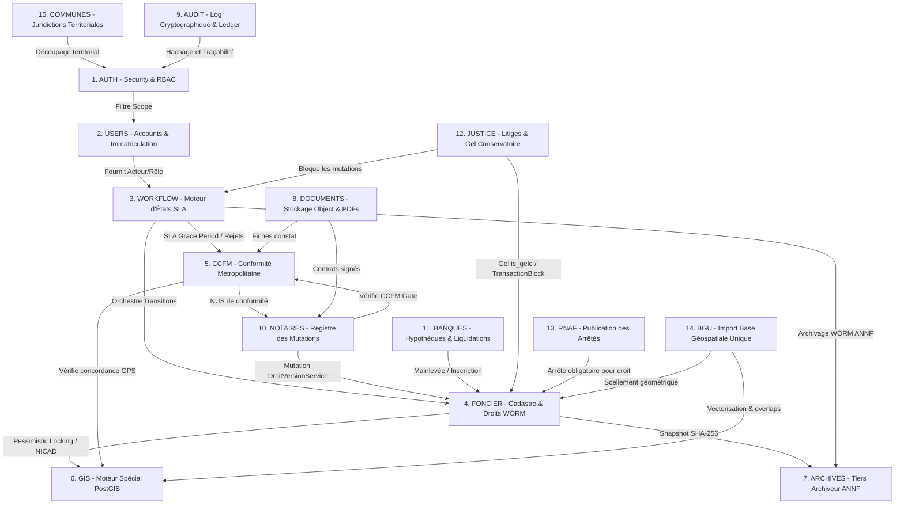

# 🗺️ Carte Système Unifiée — FONCIER+ (Republic of Niger)

**République du Niger**  
*Ministère de l'Urbanisme, de l'Habitat et du Domaine Foncier*  
*Statut : Approuvé & Implémenté (v4.0.0-Core)*

---

## 🌐 1. Architecture Globale Interconnectée

Le cadastre numérique souverain du Niger (**FONCIER+**) s'appuie sur une architecture microservices modulaire hautement sécurisée. Les 15 sous-systèmes critiques coopèrent de manière asynchrone par messages et partagent une base de données PostgreSQL durcie avec extension spatiale PostGIS.

### 📊 Diagramme d'Interdépendance du Système

---

## 🛠️ 2. Fiches Techniques des 15 Modules Systèmes

### 🔑 1. AUTH (Authentication & RBAC)
*   **Responsabilité Métier** : Sécurisation absolue des accès, authentification forte via jetons cryptographiques JWT et ségrégation stricte des rôles administratifs nationaux.
*   **Composants Techniques** : 
    *   [security.py](file:///c:/Users/USER/Desktop/fonc%20final/backend/app/core/security.py) (Fonctions `require_role`, `get_current_user`, `verify_password`).
    *   [auth.py](file:///c:/Users/USER/Desktop/fonc%20final/backend/app/api/v1/endpoints/auth.py) (Routes d'authentification, de régénération de tokens et de double-facteur).
*   **Modèles de Données & Tables** : 
    *   Stockage en cache Redis asynchrone des sessions actives.
*   **Dépendances Critiques** :
    *   *Entrées* : **USERS** (pour la validation des rôles).
    *   *Sorties* : Tous les autres 14 modules (via le décorateur `@Depends(require_role)`).
*   **Intégrité & Sécurité** : Chiffrement asymétrique des tokens JWT, jetons révocables instantanément sur Redis/in-memory en cas de suspicion d'intrusion, détection proactive de brute-force IP.

---

### 👤 2. USERS (Accounts & Immatriculation)
*   **Responsabilité Métier** : Gestion des comptes des agents de l'État, des notaires agréés et des officiers bancaires. Enregistrement de l'immatriculation professionnelle.
*   **Composants Techniques** :
    *   [users.py](file:///c:/Users/USER/Desktop/fonc%20final/backend/app/api/v1/endpoints/users.py) (CRUD et administration des habilitations).
*   **Modèles de Données & Tables** :
    *   [User](file:///c:/Users/USER/Desktop/fonc%20final/backend/app/models/users.py#L6) (`users` : id, email, hashed_password, role, commune_id, est_actif).
*   **Dépendances Critiques** :
    *   *Entrées* : **COMMUNES** (pour affecter les utilisateurs à un scope géographique).
    *   *Sorties* : **AUTH** (fournit l'identité pour signature).
*   **Intégrité & Sécurité** : Mots de passe salés et hachés via `bcrypt` (passlib). Interdiction absolue de modifier le rôle d'un compte sans double-approbation administrative (`ADMIN` + `AUDITEUR`).

---

### 🔄 3. WORKFLOW (Moteur d'États & SLA)
*   **Responsabilité Métier** : Orchestration des 33 workflows légaux nigériens. Calcul automatique des SLA, gestion des escalades hiérarchiques, traitement des rejets administratifs avec prolongation de délai (SLA Grace Period).
*   **Composants Techniques** :
    *   [workflow_engine.py](file:///c:/Users/USER/Desktop/fonc%20final/backend/app/services/workflow_engine.py) (Moteur d'états asynchrone, réévaluation des échéances).
    *   [workflows.py](file:///c:/Users/USER/Desktop/fonc%20final/backend/app/api/v1/endpoints/workflows.py) (Endpoints de commande de démarrage et de validation des étapes).
*   **Modèles de Données & Tables** :
    *   [WorkflowDefinition](file:///c:/Users/USER/Desktop/fonc%20final/backend/app/models/workflow_engine.py#L92) (`workflow_definitions`).
    *   [WorkflowStepDef](file:///c:/Users/USER/Desktop/fonc%20final/backend/app/models/workflow_engine.py#L143) (`workflow_step_defs`).
    *   [WorkflowInstance](file:///c:/Users/USER/Desktop/fonc%20final/backend/app/models/workflow_engine.py#L214) (`workflow_instances`).
    *   [WorkflowStepLog](file:///c:/Users/USER/Desktop/fonc%20final/backend/app/models/workflow_engine.py#L300) (`workflow_step_logs`).
    *   [WorkflowSignature](file:///c:/Users/USER/Desktop/fonc%20final/backend/app/models/workflow_engine.py#L368) (`workflow_signatures`).
    *   [WorkflowEscalade](file:///c:/Users/USER/Desktop/fonc%20final/backend/app/models/workflow_engine.py#L428) (`workflow_escalades`).
*   **Dépendances Critiques** :
    *   *Entrées* : **USERS** (rôle requis).
    *   *Sorties* : **FONCIER** (modifications des droits fonciers à l'étape finale), **ARCHIVES** (archivage final).
*   **Intégrité & Sécurité** : Horodatage immuable de chaque étape. Hachage cryptographique SHA-256 de chaque transition d'état, sauvegardé dans la table `workflow_signatures`.

---

### 🗺️ 4. FONCIER (Cadastre & Droits WORM)
*   **Responsabilité Métier** : Registre national unique et inviolable de la propriété foncière. Gestion des versions de titres (WORM : Write Once, Read Many). Interdiction de modification sur une ligne de droit foncier existante.
*   **Composants Techniques** :
    *   [parcellaire_service.py](file:///c:/Users/USER/Desktop/fonc%20final/backend/app/services/parcellaire_service.py) (Attribution NICAD avec verrouillage pessimiste SQL, refontes).
    *   [droits_service.py](file:///c:/Users/USER/Desktop/fonc%20final/backend/app/services/droits_service.py) (Chaînage de version, mutation, vérification de la règle des 100% de propriété).
    *   [cadastre_parcellaire.py](file:///c:/Users/USER/Desktop/fonc%20final/backend/app/api/v1/endpoints/cadastre_parcellaire.py) (Routes cadastrales).
*   **Modèles de Données & Tables** :
    *   [Parcelle](file:///c:/Users/USER/Desktop/fonc%20final/backend/app/models/parcellaire.py#L219) (`parcelles` : id, nicad, surface_officielle, is_gele).
    *   [RightHolder](file:///c:/Users/USER/Desktop/fonc%20final/backend/app/models/droits_fonciers.py#L138) (`right_holders`).
    *   [ParcelRightVersion](file:///c:/Users/USER/Desktop/fonc%20final/backend/app/models/droits_fonciers.py#L252) (`parcel_right_version`).
    *   [PropertyTransfer](file:///c:/Users/USER/Desktop/fonc%20final/backend/app/models/droits_fonciers.py#L366) (`property_transfers`).
*   **Dépendances Critiques** :
    *   *Entrées* : **WORKFLOW** (validation finale), **RNAF** (référence arrêté requis).
    *   *Sorties* : **GIS** (vectorisation), **ARCHIVES** (archivage ANNF obligatoire).
*   **Intégrité & Sécurité** : Les tables cadastrales interdisent l'action `UPDATE` via des triggers de base de données PostgreSQL. La somme des pourcentages de propriété sur chaque parcelle doit impérativement égaler 100%. Chaque ligne de droit contient un `sha256_version` chaîné sur la version précédente.

---

### 🛡️ 5. CCFM (Conformité Foncière Métropolitaine)
*   **Responsabilité Métier** : Traitement et délivrance du Certificat de Conformité Foncière Métropolitaine. Validation obligatoire des transactions et des successions cadastrales.
*   **Composants Techniques** :
    *   [ccfm.py](file:///c:/Users/USER/Desktop/fonc%20final/backend/app/api/v1/endpoints/ccfm.py) (Enregistrement des demandes et validation des visas topographiques).
*   **Modèles de Données & Tables** :
    *   [CCFMDemande](file:///c:/Users/USER/Desktop/fonc%20final/backend/app/models/ccfm.py#L63) (`demandes_ccfm`).
    *   [FicheConstatCCFM](file:///c:/Users/USER/Desktop/fonc%20final/backend/app/models/ccfm.py#L145) (`fiches_constat_ccfm`).
    *   [RapportAppreciationCCFM](file:///c:/Users/USER/Desktop/fonc%20final/backend/app/models/ccfm.py#L175) (`rapports_appreciation_ccfm`).
*   **Dépendances Critiques** :
    *   *Entrées* : **GIS** (validation des coordonnées GPS relevées sur le terrain).
    *   *Sorties* : **NOTAIRES** (barrière CCFM Gate), **BANQUES** (garantie hypothécaire).
*   **Intégrité & Sécurité** : Génération d'un NUS unique (Numéro Unique de Scellement) chaîné en SHA-256 avec la signature électronique du Directeur Général de l'Urbanisme.

---

### 🌐 6. GIS (Moteur Spatial Spécialisé)
*   **Responsabilité Métier** : Analyse topologique de non-recouvrement (anti-fraud overlap), calcul précis des surfaces géodésiques et publication cartographique interactive.
*   **Composants Techniques** :
    *   Détection d'overlaps PostGIS via triggers spatiaux `tg_antifraude_overlap` et indexation `GIST` sur `geom`.
    *   `MapInteractive.tsx` (Composant de rendu Leaflet/Mapbox côté frontend).
*   **Modèles de Données & Tables** :
    *   Champs spatiaux `geom` (type geometry PostGIS) stockés dans les tables `parcelles` et `bgu_geojson_master`.
*   **Dépendances Critiques** :
    *   *Entrées* : **BGU** (fournit les fichiers DXF/SHP à analyser).
    *   *Sorties* : **FONCIER** (bloque l'immatriculation d'une parcelle si chevauchement détecté > 0.05m²).
*   **Intégrité & Sécurité** : Contrôle topologique strict (aucune auto-intersection, aucune zone orpheline, géométries valides obligatoires).

---

### 🗄️ 7. ARCHIVES (Tiers Archiveur ANNF)
*   **Responsabilité Métier** : Préservation à valeur probante à long terme des titres fonciers au Registre des Archives Nationales Numériques Foncières (ANNF).
*   **Composants Techniques** :
    *   [workflow_orchestrator.py](file:///c:/Users/USER/Desktop/fonc%20final/backend/app/services/workflow_orchestrator.py) (Classe `ANNFArchiveService` pour le scellement et le dépôt en stockage WORM).
*   **Modèles de Données & Tables** :
    *   [ANNFArchiveLink](file:///c:/Users/USER/Desktop/fonc%20final/backend/app/models/workflows.py#L500) (`annf_archive_links`).
    *   [ANNFRightArchive](file:///c:/Users/USER/Desktop/fonc%20final/backend/app/models/droits_fonciers.py#L632) (`annf_right_archive`).
*   **Dépendances Critiques** :
    *   *Entrées* : **FONCIER** (droits validés), **WORKFLOW** (historiques complets).
    *   *Sorties* : **AUDIT** (preuve de scellement blockchain / registre ANNF).
*   **Intégrité & Sécurité** : Stockage immuable de type WORM. Signature électronique X.509 de l'archive, couplée au hachage d'intégrité de la transaction.

---

### 📄 8. DOCUMENTS (Stockage & GED)
*   **Responsabilité Métier** : Génération des documents PDF officiels (titres fonciers, CCFM signés) et stockage cloud sécurisé des pièces jointes (plans d'arpentage, actes de vente).
*   **Composants Techniques** :
    *   MinIO Object Storage (Intégration via client asynchrone boto3).
    *   Générateur ReportLab / WeasyPrint (pour la production de PDFs sécurisés).
*   **Modèles de Données & Tables** :
    *   Champs `pdf_url` et `photos_terrain` stockés en type `JSONB` ou `Text` en base de données.
*   **Dépendances Critiques** :
    *   *Entrées* : **NOTAIRES**, **CCFM**, **JUSTICE** (fournissent les pièces justificatives).
    *   *Sorties* : **ARCHIVES** (les PDFs générés sont intégrés aux archives nationales).
*   **Intégrité & Sécurité** : Chaque document stocké fait l'objet d'un calcul de hachage SHA-256 à son dépôt. L'URL d'accès est temporaire (visibilité restreinte par signatures d'URL).

---

### 🛡️ 9. AUDIT (Log Cryptographique & Ledger)
*   **Responsabilité Métier** : Traçabilité absolue de chaque opération. Surveillance de la santé système et détection des fraudes administratives ou techniques.
*   **Composants Techniques** :
    *   Fichier de configuration de log centralisé et surveillance asynchrone.
*   **Modèles de Données & Tables** :
    *   Vue d'audit [v_sante_systeme](file:///c:/Users/USER/Desktop/fonc%20final/backend/app/models/workflows.py#L556) (`v_sante_systeme` : indicateurs de performance, de fraude et de retards SLA).
*   **Dépendances Critiques** :
    *   *Entrées* : Tous les 15 modules écrivent dans la file d'audit.
    *   *Sorties* : Dashboard d'administration de la performance foncière.
*   **Intégrité & Sécurité** : Les logs de transactions sont dupliqués et chiffrés. Toute tentative de modification ou d'interruption du flux d'audit déclenche une alerte de sécurité nationale (SecOps).

---

### ✒️ 10. NOTAIRES (Registre des Mutations)
*   **Responsabilité Métier** : Instruction notariale sécurisée des mutations immobilières (ventes, successions, donations) et validation des signatures des parties.
*   **Composants Techniques** :
    *   [notaire.py](file:///c:/Users/USER/Desktop/fonc%20final/backend/app/api/v1/endpoints/notaire.py) (Routes réservées aux cabinets de notaires agréés du Niger).
*   **Modèles de Données & Tables** :
    *   [NotaryRegistry](file:///c:/Users/USER/Desktop/fonc%20final/backend/app/models/droits_fonciers.py#L205) (`notary_registry` : agréments ministériels, validité, régions).
*   **Dépendances Critiques** :
    *   *Entrées* : **CCFM** (exige le NUS), **JUSTICE** (vérifie l'absence de litiges).
    *   *Sorties* : **FONCIER** (déclenche `PropertyTransfer` et `DroitVersionService.effectuer_transfert`).
*   **Intégrité & Sécurité** : Barrière `CHECK_CCFM_GATE` et `CHECK_LITIGES` : le moteur refuse formellement d'enregistrer l'acte si un certificat CCFM valide manque ou si la parcelle est frappée d'un gel judiciaire.

---

### 🏦 11. BANQUES (Hypothèques & Mainlevées)
*   **Responsabilité Métier** : Immatriculation des privilèges hypothécaires, contrôle d'intégrité de la garantie bancaire et approbation des levées d'hypothèques suite au remboursement de crédit.
*   **Composants Techniques** :
    *   [banque.py](file:///c:/Users/USER/Desktop/fonc%20final/backend/app/api/v1/endpoints/banque.py) (Vérification de l'adéquation financière et signature d'actes).
*   **Modèles de Données & Tables** :
    *   [BanqueAgree](file:///c:/Users/USER/Desktop/fonc%20final/backend/app/models/metier.py#L17) (`banques_agreees`).
    *   [MortgageRegistry](file:///c:/Users/USER/Desktop/fonc%20final/backend/app/models/droits_fonciers.py#L444) (`mortgage_registry` : id, montant, banque_holder_id, statut [active|levee], rnaf_id, ccfm_validation_id).
*   **Dépendances Critiques** :
    *   *Entrées* : **FONCIER** (recherche de propriété), **CCFM** (exige un NUS valide).
    *   *Sorties* : **WORKFLOW** (mutations hypothécaires).
*   **Intégrité & Sécurité** : Une hypothèque inscrite est notifiée instantanément au cadastre de la parcelle, interdisant toute mutation sans mainlevée formelle enregistrée par la banque créancière.

---

### ⚖️ 12. JUSTICE (Litiges & Gel Conservatoire)
*   **Responsabilité Métier** : Saisie des plaintes de délimitation, gel conservatoire immédiat des parcelles litigieuses (mesure de protection de l'épargne publique) et enregistrement des ordonnances judiciaires.
*   **Composants Techniques** :
    *   [justice.py](file:///c:/Users/USER/Desktop/fonc%20final/backend/app/api/v1/endpoints/justice.py) (Greffe du Tribunal de Grande Instance).
*   **Modèles de Données & Tables** :
    *   [ParcelDispute](file:///c:/Users/USER/Desktop/fonc%20final/backend/app/models/droits_fonciers.py#L562) (`parcel_disputes`).
    *   [TransactionBlock](file:///c:/Users/USER/Desktop/fonc%20final/backend/app/models/workflows.py#L379) (`transaction_blocks` : id, parcelle_id, type_blockage [JUSTICE], statut [ACTIF|CLOS], motif).
*   **Dépendances Critiques** :
    *   *Entrées* : **FONCIER** (cible du litige).
    *   *Sorties* : **WORKFLOW** (verrouille l'instance du workflow).
*   **Intégrité & Sécurité** : Dès l'ouverture d'un litige, l'attribut `is_gele` de la parcelle passe à `True` en base de données. Toute action d'écriture sur cette parcelle en dehors du greffe lève une exception fatale.

---

### 📜 13. RNAF (Registre National des Arrêtés Fonciers)
*   **Responsabilité Métier** : Immatriculation et publicité des arrêtés de lotissement, d'expropriation ou d'aménagement pris par les gouverneurs et ministres.
*   **Composants Techniques** :
    *   [rnaf.py](file:///c:/Users/USER/Desktop/fonc%20final/backend/app/api/v1/endpoints/rnaf.py) (Saisie et publication des décrets fonciers nationaux).
*   **Modèles de Données & Tables** :
    *   [RNAFWorkflow](file:///c:/Users/USER/Desktop/fonc%20final/backend/app/models/workflows.py#L99) (`rnaf`).
    *   [ArreteUrbanisme](file:///c:/Users/USER/Desktop/fonc%20final/backend/app/models/parcellaire.py#L122) (`arretes_urbanisme`).
*   **Dépendances Critiques** :
    *   *Entrées* : **USERS** (Directeur de l'Urbanisme).
    *   *Sorties* : **FONCIER** (Un titre de propriété ne peut être créé sans l'identifiant de son arrêté RNAF source).
*   **Intégrité & Sécurité** : Les arrêtés RNAF sont scellés numériquement en base de données avec recalcul périodique du hachage de l'arrêté pour détecter toute falsification rétroactive.

---

### 📐 14. BGU (Base Géospatiale Unique)
*   **Responsabilité Métier** : Dépôt, vectorisation et scellement géométrique officiel des plans topographiques. Assure la concordance absolue entre le cadastre administratif et la réalité cartographique.
*   **Composants Techniques** :
    *   [bgu_service.py](file:///c:/Users/USER/Desktop/fonc%20final/backend/app/services/bgu_service.py) (Traitement géospatial et extraction des limites).
*   **Modèles de Données & Tables** :
    *   [BGUGeoJSONMaster](file:///c:/Users/USER/Desktop/fonc%20final/backend/app/models/parcellaire.py#L538) (`bgu_geojson_master` : id, parcelle_id, geojson_data, scelle, scelle_at, scelle_par).
    *   [BGUParcelStatus](file:///c:/Users/USER/Desktop/fonc%20final/backend/app/models/workflows.py#L220) (`bgu_parcel_status`).
*   **Dépendances Critiques** :
    *   *Entrées* : **GIS** (effectue les calculs PostGIS).
    *   *Sorties* : **FONCIER** (création cadastrale).
*   **Intégrité & Sécurité** : Scellement de la géométrie WKT (Well-Known Text) de la parcelle. Une fois scellée, la géométrie est en lecture seule absolue (WORM).

---

### 🏛️ 15. COMMUNES (Juridictions Territoriales)
*   **Responsabilité Métier** : Gestion du découpage administratif du Niger (Régions, Communes Urbaines et Rurales). Ségrégation géographique des données (un agent municipal de Maradi ne peut pas valider un dossier de Niamey).
*   **Composants Techniques** :
    *   [scope_filter.py](file:///c:/Users/USER/Desktop/fonc%20final/backend/app/core/scope_filter.py) (Classe `ScopeFilter` injectant dynamiquement des clauses `WHERE` selon la juridiction territoriale du compte connecté).
*   **Modèles de Données & Tables** :
    *   [Region](file:///c:/Users/USER/Desktop/fonc%20final/backend/app/models/parcellaire.py#L71) (`regions`).
    *   [Commune](file:///c:/Users/USER/Desktop/fonc%20final/backend/app/models/parcellaire.py#L94) (`communes` : id, code_commune, nom, region_id, type_commune).
*   **Dépendances Critiques** :
    *   *Entrées* : Aucun.
    *   *Sorties* : **USERS**, **FONCIER**, **CCFM** (toutes les requêtes de lecture et écriture appliquent ce filtre).
*   **Intégrité & Sécurité** : L'injection de la juridiction s'opère au niveau le plus bas du moteur d'exécution SQL, prévenant toute faille de type IDOR (Insecure Direct Object Reference) d'un niveau territorial vers un autre.

---

## 🔒 3. Matrice de Sécurité & Transit Inter-Module

Le tableau ci-dessous synthétise les protocoles d'intégrité appliqués aux communications et mutations inter-modules :

| Source | Destination | Type de Flux | Protocole / Règle d'Intégrité | Statut |
| :--- | :--- | :--- | :--- | :--- |
| **NOTAIRES** | **FONCIER** | Mutation | `DroitVersionService.creer_nouvelle_version` (SHA-256) | **ACTIF (100% WORM)** |
| **CCFM** | **NOTAIRES** | Validation | `CHECK_CCFM_GATE` (Trigger asynchrone non interceptable) | **ACTIF** |
| **JUSTICE** | **WORKFLOW** | Blocage | `TransactionBlock` (Met `is_gele` à True) | **ACTIF** |
| **BGU** | **GIS** | Overlap check | Trigger `tg_antifraude_overlap` (Tolérance max 0.05m²) | **ACTIF** |
| **FONCIER** | **ARCHIVES** | Archivage | `ANNFArchiveService.archiver` (Horodatage asymétrique X.509) | **ACTIF** |
| **AUTH** | **COMMUNES** | Scope Check | `ScopeFilter` (Ségrégation PostgreSQL automatique) | **ACTIF** |
