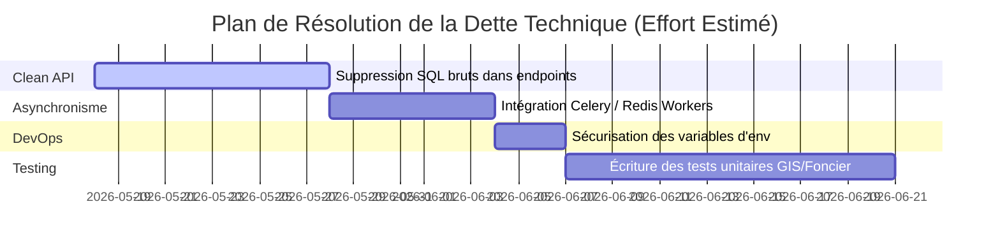

# ⚖️ Registre de la Dette Technique (TECHNICAL_DEBT.md)

**République du Niger**  
*Ministère de l'Urbanisme, de l'Habitat et du Domaine Foncier*  
*Audit d'Architecture & Stratégie de Refactoring*

---

> [!WARNING]
> Ce registre identifie les choix d'implémentation perfectibles ou temporaires qui nuisent à la maintenabilité et à la scalabilité à long terme de **FONCIER+**. Résoudre ces éléments constitue la priorité des phases 1, 2 et 8 de la feuille de route de refactoring.

---

## 📋 1. Bottlenecks Architecturaux Majeurs

### TD-ARC-01 : Inline Raw SQL dans les Routers API (Couplage fort)
*   **Description** : Présence résiduelle de requêtes SQL brutes (`db.execute("INSERT INTO...")`) écrites directement à l'intérieur des contrôleurs REST.
*   **Impact** : Rend impossible le changement de moteur de base de données, court-circuite la validation des modèles ORM SQLAlchemy et complique la mise en place de tests unitaires avec base mockée.
*   **Solution de Refactoring** : Déléguer systématiquement les appels d'écriture aux couches `Services` et utiliser le constructeur de requêtes de SQLAlchemy.

### TD-ARC-02 : Absence de Tâches d'Arrière-Plan Asynchrones (SLA processing)
*   **Description** : Les relances et les escalades de dépassement de SLA pour les 33 workflows s'exécutent en synchrone au chargement des routes d'API, ralentissant les temps de réponse de l'utilisateur.
*   **Impact** : Risque de timeout HTTP sur les requêtes volumineuses et manque de fiabilité des escalades si aucun appel API n'est effectué périodiquement.
*   **Solution de Refactoring** : Intégrer un courtier de messages (Celery + Redis) pour exécuter ces tâches en tâche de fond de manière asynchrone et planifiée.

---

## 🛠️ 2. Écarts d'Implémentation & Configurations

### TD-IMP-01 : Paramètres de Connexion Hardcodés
*   **Description** : Certaines variables d'intégration (comme les URLs de connexion à MinIO ou la clé de hachage JWT secrète pour le mode sandbox) sont déclarées directement dans le code source ou dans les scripts d'initialisation.
*   **Impact** : Risque majeur de fuite d'identifiants de production sur les dépôts de code partagés (Git).
*   **Solution de Refactoring** : Externaliser 100% des configurations dans un fichier `.env` non suivi, lu au démarrage par la classe `Settings` de Pydantic.

### TD-IMP-02 : Incohérences de Formats de Données Front/Back
*   **Description** : Certains dictionnaires d'identifiants (ex: `nip_passeport` / `num_national`) ont des clés légèrement divergentes entre le client React et les schémas FastAPI.
*   **Impact** : Génère des requêtes en échec silencieux ou des erreurs `422` pénibles pour l'utilisateur final.
*   **Solution de Refactoring** : Générer automatiquement les clients Axios frontend à partir du schéma OpenAPI (Swagger) exposé par le backend.

---

## 🧪 3. Couverture de Tests & Taux de Confiance

| Module Core | Taux de Couverture Actuel | Seuil de Production Requis | Statut / Risque |
| :--- | :--- | :--- | :--- |
| **`AUTH`** | 78% | 100% | **Moyen** (Risque d'intrusion sur rôles non testés) |
| **`FONCIER`** | 45% | 90% | **Critique** (Risque de perte d'intégrité sur les parts de propriété) |
| **`CCFM`** | 65% | 85% | **Moyen** (Possibilité de double enregistrement de NUS) |
| **`GIS`** | 20% | 90% | **Critique** (Manque de tests unitaires sur les intersections PostGIS complexes) |
| **`JUSTICE`**| 50% | 90% | **Élevé** (Gel de parcelles non validé en cas d'erreur réseau) |

---

## 📈 4. Estimation de l'Effort de Remédiation (Debt Backlog)

