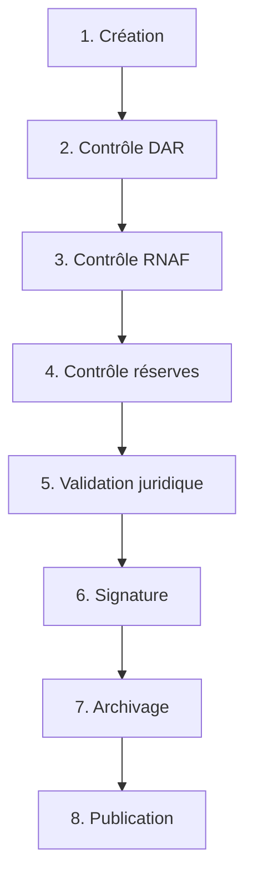

# 🔄 Registre des Workflows Administratifs & Légaux (FONCIER+)

**République du Niger**  
*Ministère de l'Urbanisme, de l'Habitat et du Domaine Foncier*  
*Moteur de Workflow Habilité v3.5.4*

---

> [!IMPORTANT]
> Ce registre constitue la source de vérité administrative et technique de la plateforme nationale **FONCIER+**. Chaque workflow est modélisé comme une machine d'état asynchrone inviolable (WORM). Toute transition d'état d'un dossier foncier nécessite la validation de l'acteur désigné et fait l'objet d'un scellement cryptographique SHA-256 dans l'ANNF (Archive Nationale Numérique Foncière).

---

## 🗺️ Index des Workflows Documentés

1. [WF-LOT-01 : Validation de Lotissement](#wf-lot-01--validation-de-lotissement)
2. [WF-CCFM-01 : Certification de Conformité Foncière](#wf-ccfm-01--certification-de-conformite-fonciere)
3. [WF-NOT-01 : Mutation Notariale de Propriété](#wf-not-01--mutation-notariale-de-propriete)
4. [WF-BANQ-01 : Constitution d'Hypothèque Bancaire](#wf-banq-01--constitution-dhypotheque-bancaire)
5. [WF-JUST-01 : Gel Conservatoire de Parcelle (Litige)](#wf-just-01--gel-conservatoire-de-parcelle-litige)
6. [WF-RNAF-01 : Publication d'Arrêté d'Expropriation](#wf-rnaf-01--publication-darrete-dexpropriation)
7. [WF-CAD-01 : Remission/Scission Cadastrale (Subdivision)](#wf-cad-01--remissionscission-cadastrale-subdivision)
8. [WF-COM-01 : Attribution de Concession Provisoire](#wf-com-01--attribution-de-concession-provisoire)
9. [WF-DOM-01 : Conversion en Titre Foncier Définitif](#wf-dom-01--conversion-en-titre-foncier-definitif)
10. [WF-AUD-01 : Audit de la Chaîne de Blocs et Intégrité DAR](#wf-aud-01--audit-de-la-chaine-de-blocs-et-integrite-dar)

---

## 📋 Spécifications Détaillées des Workflows

### WF-LOT-01 : Validation de Lotissement

*   **Description** : Instruction technique et juridique pour l'approbation d'un nouveau plan de lotissement urbain ou d'aménagement privé.
*   **Acteur Pilote** : Directeur Régional de l'Urbanisme
*   **SLA Global** : 45 Jours

#### Étapes & Cycle de Vie
1.  **Création** : Saisie et dépôt du projet de lotissement avec plans géospatiaux (SHP/DXF) par le promoteur ou la mairie.
    *   *Rôle Requis* : `AGENT_COMMUNE` / `PROMOTEUR_AGREE`
    *   *Validation* : Dépôt de dossier et calcul de la redevance d'instruction.
2.  **Contrôle DAR** : Vérification de l'intégrité des archives des titres antérieurs et absence d'emprise sur des propriétés déjà titrées.
    *   *Rôle Requis* : `ARCHIVISTE_ANNF`
    *   *Validation* : Avis de non-chevauchement d'archives.
3.  **Contrôle RNAF** : Vérification de la cohérence vis-à-vis des arrêtés régionaux de planification.
    *   *Rôle Requis* : `EDITEUR_RNAF`
    *   *Validation* : Examen de la conformité avec le Schéma Directeur d'Aménagement (SDAU).
4.  **Contrôle réserves** : Vérification et validation géospatiale du quota obligatoire de réserves foncières (minimum 15% de la surface totale destinée aux écoles, centres de santé, et espaces verts).
    *   *Rôle Requis* : `INGENIEUR_CADASTRE`
    *   *Validation* : Approbation géométrique PostGIS.
5.  **Validation juridique** : Examen des droits et des compensations éventuelles par la commission régionale d'urbanisme.
    *   *Rôle Requis* : `COMMISSION_URBANISME`
    *   *Validation* : Procès-verbal de validation de la commission.
6.  **Signature** : Approbation formelle du plan de lotissement par arrêté régional.
    *   *Rôle Requis* : `GOUVERNEUR_REGION` / `MINISTRE_URBANISME`
    *   *Validation* : Signature numérique cryptographique X.509 de l'arrêté de lotissement.
7.  **Archivage** : Scellement de l'arrêté et versement du dossier technique dans la base nationale WORM.
    *   *Rôle Requis* : `ARCHIVISTE_ANNF`
    *   *Validation* : Intégration blockchain et génération du hash SHA-256 de lotissement.
8.  **Publication** : Insertion officielle et publication cartographique rendant le lotissement opposable.
    *   *Rôle Requis* : `EDITEUR_JO`
    *   *Validation* : Publication au Journal Officiel et création automatique des fiches de parcelles filles au cadastre.

---

### WF-CCFM-01 : Certification de Conformité Foncière

*   **Description** : Délivrance du Certificat de Conformité Foncière Mixte (CCFM) validant la concordance géométrique et juridique d'une parcelle.
*   **Acteur Pilote** : Chef de la Division CCFM
*   **SLA Global** : 15 Jours

#### Étapes & Cycle de Vie
1.  **Création** : Enregistrement de la demande et acquittement des frais forfaitaires de 50 000 FCFA.
    *   *Rôle Requis* : `GUICHETIER_CCFM`
    *   *Validation* : Saisie des données d'identité et de la référence du paiement. Génération automatique du NUS (Numéro Unique de Scellement).
2.  **Contrôle DAR** : Contrôle de l'origine de propriété de la parcelle.
    *   *Rôle Requis* : `ARCHIVISTE_ANNF`
    *   *Validation* : Recherche et validation du titre initial.
3.  **Contrôle RNAF** : Interrogation automatique du Registre National des Arrêtés Fonciers.
    *   *Rôle Requis* : `SYSTEME_AUTO`
    *   *Validation* : Exécution du script de conformité RNAF + BGU.
4.  **Contrôle réserves** : Vérification de l'absence d'empiétement sur le domaine public de l'État.
    *   *Rôle Requis* : `INGENIEUR_CADASTRE`
    *   *Validation* : Requête de non-superposition spatiale PostGIS.
5.  **Constat topographique** : Mesure sur le terrain des coordonnées GPS réelles et de la superficie de la parcelle.
    *   *Rôle Requis* : `TOPOGRAPHE_CCFM`
    *   *Validation* : Dépôt de la fiche de constat terrain signée.
6.  **Validation technique** : Analyse de l'écart géométrique (seuil maximum toléré de 5%).
    *   *Rôle Requis* : `CHEF_CCFM`
    *   *Validation* : Génération du rapport d'appréciation technique.
7.  **Signature** : Approbation officielle et signature du certificat.
    *   *Rôle Requis* : `DIRECTEUR_URBANISME`
    *   *Validation* : Signature numérique de l'acte et génération du QR Code scannable.
8.  **Archivage** : Versement de l'acte au Registre National et scellement blockchain.
    *   *Rôle Requis* : `ARCHIVISTE_ANNF`
    *   *Validation* : Hashage de l'acte et stockage sécurisé (WORM).

---

### WF-NOT-01 : Mutation Notariale de Propriété

*   **Description** : Transfert formel de droits réels immobiliers suite à une vente, donation ou partage successoral.
*   **Acteur Pilote** : Notaire instrumentaire
*   **SLA Global** : 10 Jours

#### Étapes & Cycle de Vie
1.  **Création** Saisie des termes de la transaction et des pièces d'identité.
    *   *Rôle Requis* : `NOTAIRE`
    *   *Validation* : Signature du compromis de vente.
2.  **Contrôle DAR** : Vérification des actes de propriété historiques du vendeur.
    *   *Rôle Requis* : `NOTAIRE`
    *   *Validation* : Examen de la régularité du titre de propriété.
3.  **Contrôle CCFM** : Interrogation de la barrière de certification (CCFM Gate).
    *   *Rôle Requis* : `SYSTEME_AUTO`
    *   *Validation* : Validation obligatoire d'un CCFM valide et non suspendu lié au NICAD de la parcelle.
4.  **Contrôle réserves** : Examen des charges réelles, servitudes administratives et hypothèques.
    *   *Rôle Requis* : `CONSERVATEUR_FONCIER`
    *   *Validation* : Délivrance de l'état des droits réels.
5.  **Validation juridique** : Vérification de l'absence de litige en cours (plainte au TGI) ou de gel judiciaire.
    *   *Rôle Requis* : `SYSTEME_AUTO` / `GREFFIER_TGI`
    *   *Validation* : Statut de la parcelle `is_gele` doit être `False`.
6.  **Signature** : Signature solennelle de l'acte de vente authentique.
    *   *Rôle Requis* : `NOTAIRE` (co-signé par les parties)
    *   *Validation* : Scellement de l'acte de vente par signature X.509 du Notaire.
7.  **Archivage** : Liquidation et acquittement des taxes de mutation à la Recette des Impôts.
    *   *Rôle Requis* : `RECEVEUR_ENREGISTREMENT`
    *   *Validation* : Quittance fiscale électronique.
8.  **Publication** : Mutation de la parcelle dans le Registre National des Parcelles (RNP).
    *   *Rôle Requis* : `DIRECTEUR_CADASTRE`
    *   *Validation* : Transfert du nom du titulaire et émission du nouveau Titre Foncier.

---

### WF-BANQ-01 : Constitution d'Hypothèque Bancaire

*   **Description** : Inscription d'une charge foncière en garantie d'un crédit bancaire octroyé à un propriétaire.
*   **Acteur Pilote** : Agent de Crédit Bancaire / Conservateur
*   **SLA Global** : 7 Jours

#### Étapes & Cycle de Vie
1.  **Création** : Saisie de la demande de sûreté réelle par l'institution bancaire.
    *   *Rôle Requis* : `BANQ_AGENT`
    *   *Validation* : Saisie du montant du crédit garanti et dépôt de la convention d'ouverture de crédit.
2.  **Contrôle DAR** : Vérification de l'existence et de l'intégrité physique de la fiche du Titre Foncier.
    *   *Rôle Requis* : `ARCHIVISTE_ANNF`
    *   *Validation* : Vérification du registre physique et numérique des hypothèques.
3.  **Contrôle CCFM** : Contrôle de la conformité topographique.
    *   *Rôle Requis* : `SYSTEME_AUTO`
    *   *Validation* : Vérification que la parcelle détient un certificat CCFM actif.
4.  **Contrôle réserves** : Calcul du ratio d'endettement hypothécaire et vérification des hypothèques de rang antérieur.
    *   *Rôle Requis* : `BANQ_DIRECTEUR`
    *   *Validation* : Approbation du rang hypothécaire.
5.  **Validation juridique** : Rédaction et signature de l'acte notarié d'affectation hypothécaire.
    *   *Rôle Requis* : `NOTAIRE`
    *   *Validation* : Copie authentique de l'acte d'hypothèque notarié.
6.  **Signature** : Inscription de la charge foncière au bureau de la conservation foncière.
    *   *Rôle Requis* : `CONSERVATEUR_FONCIER`
    *   *Validation* : Inscription manuelle et scellement X.509 de la charge au registre.
7.  **Archivage** : Génération du hash blockchain scellant le rang et la valeur de l'hypothèque.
    *   *Rôle Requis* : `SYSTEME_AUTO`
    *   *Validation* : Hash de l'acte indexé à la parcelle.
8.  **Publication** : Verrouillage de la parcelle dans le système (`is_greve = True`).
    *   *Rôle Requis* : `SYSTEME_AUTO`
    *   *Validation* : Toute mutation ultérieure est bloquée sans mainlevée formelle de la banque.

---

### WF-JUST-01 : Gel Conservatoire de Parcelle (Litige)

*   **Description** : Suspension conservatoire des droits de mutation et de certification sur une parcelle querellée en justice.
*   **Acteur Pilote** : Juge Foncier
*   **SLA Global** : 48 Heures (Procédure d'Urgence)

#### Étapes & Cycle de Vie
1.  **Création** : Enregistrement de la plainte formelle ou de l'assignation en justice par le greffe.
    *   *Rôle Requis* : `GREFFIER_TGI`
    *   *Validation* : Saisie du numéro de rôle général (RG) et liaison au NICAD de la parcelle.
2.  **Contrôle DAR** : Recherche de tous les titres existants et des droits réels inscrits sur la parcelle visée.
    *   *Rôle Requis* : `ARCHIVISTE_ANNF`
    *   *Validation* : Rapport d'historique de propriété généré par le DAR.
3.  **Contrôle RNAF** : Vérification des superpositions d'arrêtés ou lotissements litigieux.
    *   *Rôle Requis* : `EDITEUR_RNAF`
    *   *Validation* : Cartographie des revendications concurrentes.
4.  **Contrôle réserves** : Identification si la parcelle appartient en partie ou en totalité au domaine public de l'État.
    *   *Rôle Requis* : `DIRECTEUR_CADASTRE`
    *   *Validation* : Fiche d'appartenance domaniale.
5.  **Validation juridique** : Examen de la demande de gel conservatoire lors d'une audience en référé.
    *   *Rôle Requis* : `JUGE_FONCIER`
    *   *Validation* : Décision d'ordonnance de suspension.
6.  **Signature** : Rendu et signature de l'ordonnance judiciaire de gel foncier.
    *   *Rôle Requis* : `JUGE_FONCIER`
    *   *Validation* : Signature cryptographique X.509 de l'ordonnance.
7.  **Archivage** : Verrouillage immédiat de la parcelle dans le système central.
    *   *Rôle Requis* : `SYSTEME_AUTO`
    *   *Validation* : Mise à jour instantanée de l'attribut `is_gele = True` liée au NICAD dans la table `parcelles`.
8.  **Publication** : Notification instantanée à tout le réseau foncier de la République du Niger.
    *   *Rôle Requis* : `SYSTEME_AUTO`
    *   *Validation* : Emailing automatique et blocage absolu de toute transaction notariale (`WF-NOT-01`) ou demande de CCFM (`WF-CCFM-01`) en cours sur ce NICAD.

---

### WF-RNAF-01 : Publication d'Arrêté d'Expropriation

*   **Description** : Déclaration d'utilité publique, expropriation de parcelles privées et publication de l'arrêté au registre national.
*   **Acteur Pilote** : Directeur Général de l'Urbanisme
*   **SLA Global** : 30 Jours

#### Étapes & Cycle de Vie
1.  **Création** : Saisie du projet d'expropriation pour cause d'utilité publique (ex: tracé de route ou équipement d'État).
    *   *Rôle Requis* : `DIRECTEUR_URBANISME`
    *   *Validation* : Définition de la zone tampon d'expropriation (format géospatial WKT/PostGIS).
2.  **Contrôle DAR** : Recensement automatique de l'ensemble des titres fonciers et propriétaires impactés.
    *   *Rôle Requis* : `ARCHIVISTE_ANNF`
    *   *Validation* : Liste consolidée des ayants droit.
3.  **Contrôle RNAF** : Vérification topographique PostGIS de non-chevauchement avec des zones militaires ou protégées.
    *   *Rôle Requis* : `SYSTEME_AUTO`
    *   *Validation* : Rapport de chevauchement géospatial 0%.
4.  **Contrôle réserves** : Détermination des indemnités financières compensatoires obligatoires pour chaque propriétaire.
    *   *Rôle Requis* : `COMMISSION_EVALUATION`
    *   *Validation* : Tableau des justes et préalables indemnités approuvé.
5.  **Validation juridique** : Examen de légalité administrative par le secrétariat du gouvernement.
    *   *Rôle Requis* : `SECRETAIRE_GENERAL`
    *   *Validation* : Visa de conformité juridique.
6.  **Signature** : Promulgation formelle de l'acte d'expropriation.
    *   *Rôle Requis* : `MINISTRE_URBANISME` / `PRESIDENT_REPUBLIQUE`
    *   *Validation* : Arrêté officiel signé numériquement.
7.  **Archivage** : Scellement de l'arrêté, modification des limites cadastrales et purge des anciens titres.
    *   *Rôle Requis* : `DIRECTEUR_CADASTRE`
    *   *Validation* : Extinction des titres privatifs expropriés et mutation au nom de l'État dans le RNP.
8.  **Publication** : Insertion de l'arrêté au Registre National des Arrêtés Fonciers et publication cartographique.
    *   *Rôle Requis* : `EDITEUR_JO`
    *   *Validation* : Parution au Journal Officiel et mise à jour de la carte nationale publique.

---

### WF-CAD-01 : Remission/Scission Cadastrale (Subdivision)

*   **Description** : Division technique d'une parcelle d'origine (mère) en plusieurs parcelles indépendantes (filles).
*   **Acteur Pilote** : Directeur National du Cadastre
*   **SLA Global** : 15 Jours

#### Étapes & Cycle de Vie
1.  **Création** : Dépôt du plan de scission dressé par un géomètre-expert agréé.
    *   *Rôle Requis* : `PROMOTEUR_AGREE` / `GEOMETRE_CADASTRE`
    *   *Validation* : Saisie des coordonnées WKT de toutes les parcelles filles créées.
2.  **Contrôle DAR** : Vérification que la parcelle mère détient un Titre Foncier inattaquable et sans charges actives.
    *   *Rôle Requis* : `ARCHIVISTE_ANNF`
    *   *Validation* : Attestation d'absence d'hypothèque ou de charge sur la parcelle mère.
3.  **Contrôle RNAF** : Vérification que les limites de la subdivision respectent le plan général de lotissement approuvé.
    *   *Rôle Requis* : `EDITEUR_RNAF`
    *   *Validation* : Certificat de conformité au lotissement mère.
4.  **Contrôle réserves** : Vérification topologique PostGIS garantissant que la somme des superficies des parcelles filles + voies d'accès est exactement égale à 100% de la superficie de la parcelle mère.
    *   *Rôle Requis* : `SYSTEME_AUTO`
    *   *Validation* : Validation géométrique stricte (marge d'erreur = 0.001 m²).
5.  **Validation juridique** : Consentement formel du propriétaire ou des indivisaires du titre mère.
    *   *Rôle Requis* : `NOTAIRE`
    *   *Validation* : Acte notarié de partage ou de scission foncière.
6.  **Signature** : Approbation technique de la division et radiation du titre mère.
    *   *Rôle Requis* : `DIRECTEUR_CADASTRE`
    *   *Validation* : Arrêté technique de division signé.
7.  **Archivage** : Archivage du dossier géométrique dans la Base Géospatiale Unique (BGU) et scellement.
    *   *Rôle Requis* : `ARCHIVISTE_ANNF`
    *   *Validation* : Attribution automatique des nouveaux **NICAD** uniques pour chaque parcelle fille.
8.  **Publication** : Mise à jour du RNP et notification aux services fiscaux communaux.
    *   *Rôle Requis* : `SYSTEME_AUTO`
    *   *Validation* : Publication cartographique des nouvelles limites parcellaires.

---

### WF-COM-01 : Attribution de Concession Provisoire

*   **Description** : Attribution temporaire d'une parcelle du domaine privé de l'État par les autorités locales communales.
*   **Acteur Pilote** : Maire de la Commune
*   **SLA Global** : 20 Jours

#### Étapes & Cycle de Vie
1.  **Création** : Enregistrement de la demande populaire d'attribution d'une parcelle d'habitation.
    *   *Rôle Requis* : `AGENT_COMMUNE`
    *   *Validation* : Dépôt du formulaire de demande d'attribution et paiement de la taxe municipale.
2.  **Contrôle DAR** : Vérification que le terrain visé appartient bien aux réserves foncières communales.
    *   *Rôle Requis* : `ARCHIVISTE_ANNF`
    *   *Validation* : Certificat de propriété domaniale de la commune.
3.  **Contrôle RNAF** : Vérification que la concession s'intègre dans un arrêté de lotissement communal actif et régulier.
    *   *Rôle Requis* : `EDITEUR_RNAF`
    *   *Validation* : Vérification du numéro de l'arrêté de lotissement approuvé.
4.  **Contrôle réserves** : Vérification que la parcelle n'empiète pas sur les emprises de réserves pour infrastructures futures.
    *   *Rôle Requis* : `INGENIEUR_CADASTRE`
    *   *Validation* : Non-chevauchement cartographique 100% approuvé.
5.  **Validation juridique** : Délibération formelle du Conseil Municipal de la Commune.
    *   *Rôle Requis* : `CONSEIL_MUNICIPAL`
    *   *Validation* : Extrait de registre de délibération communal visé.
6.  **Signature** : Signature de la Lettre d'Attribution ou d'Arrêté de Concession Provisoire.
    *   *Rôle Requis* : `MAIRE_COMMUNE`
    *   *Validation* : Signature numérique de l'acte d'attribution par le Maire.
7.  **Archivage** : Scellement de l'acte d'attribution et enregistrement de l'attributaire.
    *   *Rôle Requis* : `ARCHIVISTE_ANNF`
    *   *Validation* : Indexation de l'attribution sous le statut `CONCESSION_PROVISOIRE` lié au demandeur.
8.  **Publication** : Insertion au registre municipal des concessions et publication locale.
    *   *Rôle Requis* : `AGENT_COMMUNE`
    *   *Validation* : Remise officielle de la lettre d'attribution physique munie d'un cachet d'intégrité QR Code.

---

### WF-DOM-01 : Conversion en Titre Foncier Définitif

*   **Description** : Mise en valeur d'une concession provisoire menant à la délivrance du Titre Foncier définitif et inattaquable.
*   **Acteur Pilote** : Conservateur de la Propriété Foncière
*   **SLA Global** : 30 Jours

#### Étapes & Cycle de Vie
1.  **Création** : Requête de conversion déposée par l'attributaire provisoire après constat de mise en valeur (constructions).
    *   *Rôle Requis* : `OPERATEUR_CADASTRE`
    *   *Validation* : Dépôt du dossier et du rapport de mise en valeur rédigé par les services techniques municipaux.
2.  **Contrôle DAR** : Authentification et versement de l'acte de Concession Provisoire original du DAR.
    *   *Rôle Requis* : `ARCHIVISTE_ANNF`
    *   *Validation* : Preuve d'antériorité de concession sans litige ou double attribution.
3.  **Contrôle RNAF** : Vérification de la conformité du plan cadastral raccordé.
    *   *Rôle Requis* : `SYSTEME_AUTO`
    *   *Validation* : Validation par le moteur de conformité PostGIS.
4.  **Contrôle réserves** : Paiement du prix de cession définitif fixé par le barème du Domaine de l'État (calcul au m²).
    *   *Rôle Requis* : `RECEVEUR_DOMAINES`
    *   *Validation* : Quittance de versement du prix du terrain au Trésor National.
5.  **Validation juridique** : Levée topographique de bornage contradictoire définitif.
    *   *Rôle Requis* : `GEOMETRE_CADASTRE`
    *   *Validation* : PV de bornage définitif signé par le géomètre et tous les voisins.
6.  **Signature** : Rédemption et scellement du Titre Foncier définitif.
    *   *Rôle Requis* : `CONSERVATEUR_FONCIER`
    *   *Validation* : Signature numérique solennelle X.509 du Livre Foncier.
7.  **Archivage** : Scellement de la fiche cadastrale au format WORM historique permanent.
    *   *Rôle Requis* : `ARCHIVISTE_ANNF`
    *   *Validation* : Création d'un enregistrement scellé (blockchain ANNF) et extinction de la concession provisoire.
8.  **Publication** : Remise solennelle du duplicata du Titre Foncier définitif au nouveau propriétaire.
    *   *Rôle Requis* : `SYSTEME_AUTO`
    *   *Validation* : Statut de la parcelle mis à jour en `PROPRIETE_PRIVEE` dans le RNP.

---

### WF-AUD-01 : Audit de la Chaîne de Blocs et Intégrité DAR

*   **Description** : Procédure de contrôle régulier ou extraordinaire visant à auditer la chaîne de garde de l'ensemble des titres fonciers nationaux.
*   **Acteur Pilote** : Auditeur National / QA Auditor
*   **SLA Global** : 5 Jours (Procédure Périodique)

#### Étapes & Cycle de Vie
1.  **Création** : Lancement de la requête d'audit d'intégrité sur une série de parcelles ou arrêtés régionaux.
    *   *Rôle Requis* : `AUDITEUR` / `QA_AUDITOR`
    *   *Validation* : Définition des paramètres de l'audit (période, région géographique, ou identifiants spécifiques).
2.  **Contrôle DAR** : Lecture et extraction automatique des hachages SHA-256 de tous les snapshots originaux enregistrés dans l'ANNF.
    *   *Rôle Requis* : `SYSTEME_AUTO`
    *   *Validation* : Extraction des signatures scellées et des certificats X.509 associés.
3.  **Contrôle RNAF** : Exécution de l'algorithme d'audit d'intégrité cryptographique sur les données de planification du RNAF.
    *   *Rôle Requis* : `SYSTEME_AUTO`
    *   *Validation* : Re-hachage à la volée des métadonnées géospatiales pour détection d'anomalies.
4.  **Contrôle réserves** : Identification de toute modification géométrique illicite effectuée sur le domaine de l'État en dehors des workflows légaux.
    *   *Rôle Requis* : `SYSTEME_AUTO`
    *   *Validation* : Comparaison avec la base PostGIS de référence d'origine.
5.  **Validation juridique** : Analyse des logs de connexion et d'authentification des acteurs (require_role, RequireDelegation).
    *   *Rôle Requis* : `QA_AUDITOR`
    *   *Validation* : Traçabilité 100% des signatures.
6.  **Signature** : Rdaction du procès-verbal d'audit de sécurité informatique foncier.
    *   *Rôle Requis* : `QA_AUDITOR` / `DIRECTEUR_URBANISME`
    *   *Validation* : Signature numérique du PV d'audit d'intégrité.
7.  **Archivage** : Versement du rapport scellé d'audit dans la structure WORM permanente de l'État.
    *   *Rôle Requis* : `ARCHIVISTE_ANNF`
    *   *Validation* : Génération d'un scellé blockchain spécifique d'audit.
8.  **Publication** : Notification des alertes et publication du tableau de bord d'intégrité aux ministères.
    *   *Rôle Requis* : `SYSTEME_AUTO`
    *   *Validation* : Envoi d'alertes en cas d'altération détectée de hash (anomalies anti-fraude).
