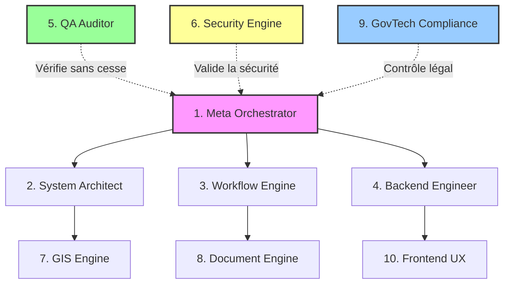

# Architecture Technique Cible

Ce document définit la vision d'architecture technique globale de la plateforme **FONCIER+** et l'organisation cognitive de ses agents.

---

## 1. COGNITIVE MULTI-AGENT BUS ARCHITECTURE
Pour orchestrer le développement, l'audit et l'évolution de la plateforme, les 10 agents IA coopèrent à travers un modèle en bus de messages coordonné par le **[Meta Orchestrator](file:///c:/Users/USER/Desktop/fonc%20final/skills/1_meta_orchestrator/README.md)** :

---

## 2. STACK TECHNIQUE DU SYSTÈME

### Backend (Souveraineté des Données & API)
- **Langage principal** : Python (3.10+)
- **Moteurs d'API** :
  - **FastAPI** : Utilisé pour les nouveaux modules à hautes performances (recherche spatiale, génération de flux GeoJSON, validation cryptographique).
  - **Flask** : Conservé pour l'infrastructure historique existante, migrant progressivement vers FastAPI via le patron d'intégration **Strangler Fig**.
- **Base de Données** : **PostgreSQL** avec l'extension spatiale **PostGIS** (Triggers de topologie, calculs de surface géodésique, prévention de chevauchements par index spatiaux `GIST`).

### Frontend (Interface Client Réactive)
- **Framework** : **React.js** (Architecture SPA robuste).
- **Styling & UI** : **Tailwind CSS** (design system responsive) & **ShadCN UI** (composants accessibles).
- **Animations** : **Framer Motion** (micro-animations premium, transitions d'état fluides).
- **Cartographie** : **Leaflet.js** et intégration GeoJSON pour le rendu des parcelles et lotissements directement sur canevas Web.

### Sécurité, Audit & Chiffrement
- **Authentification** : JWT (JSON Web Tokens) avec expiration stricte et rotation de clés.
- **Autorisation** : RBAC (Role-Based Access Control) granulaire, couvrant les 29 rôles étatiques de l'administration du Niger.
- **Sécurité Documentaire** : Signature numérique de fichiers PDF via clés cryptographiques et certificats X.509 d'État. QR codes sécurisés incrustés pour la vérification hors-ligne.
- **Journal d'Audit** : Table de logs immutable (mode append-only strict) gérée au niveau de la base de données.

---

## 3. MODULARITÉ & CONSEILS D'INTÉGRATION

### Transition Douce (Strangler Fig Pattern)
- Tout nouveau endpoint ou module fonctionnel (comme la gestion des réserves foncières ou des signatures cryptographiques) est obligatoirement écrit en **FastAPI**.
- Les modules historiques en Flask sont isolés derrière des interfaces de services propres et migrés progressivement sans jamais casser la compatibilité des clients frontends ou des terminaux mobiles régionaux.

### Découplage de la Géométrie (SIG)
- Les calculs spatiaux lourds du **[GIS Engine](file:///c:/Users/USER/Desktop/fonc%20final/skills/7_gis_engine/README.md)** sont isolés des requêtes relationnelles classiques pour éviter de bloquer le thread principal d'exécution d'API.
- Les données GeoJSON sont épurées et simplifiées côté serveur avant d'être expédiées au **[Frontend UX](file:///c:/Users/USER/Desktop/fonc%20final/skills/10_frontend_ux/README.md)** pour maintenir des performances fluides sur les navigateurs à faible puissance.
