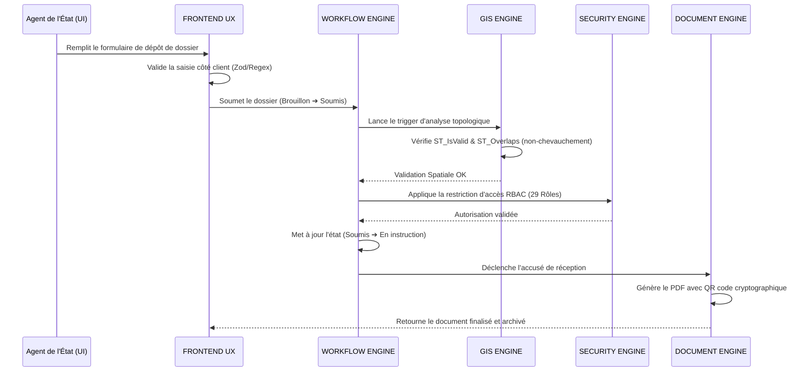

# Workflows et Méthodologie d'Exécution

## 1. MÉTHODOLOGIE OBLIGATOIRE (Séquence d'exécution Multi-Agent)
Toute modification, correction de bug ou extension fonctionnelle sur la plateforme **FONCIER+** doit suivre **STRICTEMENT** cette séquence en 8 étapes coordonnée par le **[Meta Orchestrator](file:///c:/Users/USER/Desktop/fonc%20final/skills/1_meta_orchestrator/README.md)** :

1. 🔍 **AUDIT & DIAGNOSTIC** :
   - Le **[QA Auditor](file:///c:/Users/USER/Desktop/fonc%20final/skills/5_qa_auditor/README.md)** et le **[Backend Engineer](file:///c:/Users/USER/Desktop/fonc%20final/skills/4_backend_engineer/README.md)** examinent le code existant, les bases PostgreSQL/PostGIS et les rapports d'erreurs pour localiser les anomalies.
2. 📐 **ANALYSE D'IMPACT** :
   - Le **[System Architect](file:///c:/Users/USER/Desktop/fonc%20final/skills/2_system_architect/README.md)** et le **[GIS Engine](file:///c:/Users/USER/Desktop/fonc%20final/skills/7_gis_engine/README.md)** analysent les dépendances architecturales et géospatiales de la modification proposée.
3. 📝 **DOCUMENTATION PRE-REFACTOR** :
   - Le **[GovTech Compliance](file:///c:/Users/USER/Desktop/fonc%20final/skills/9_govtech_compliance/README.md)** valide que la proposition respecte la loi foncière nigérienne. Les fichiers de spécifications correspondants sont rédigés avant l'implémentation.
4. 🗺️ **CARTOGRAPHIE DES DÉPENDANCES** :
   - Le **[Workflow Engine](file:///c:/Users/USER/Desktop/fonc%20final/skills/3_workflow_engine/README.md)** dresse la carte exacte des transitions d'état affectées (parmi les 33 workflows), ainsi que les rôles RBAC concernés.
5. 🛡️ **IDENTIFICATION DES RISQUES** :
   - Le **[Security Engine](file:///c:/Users/USER/Desktop/fonc%20final/skills/6_security_engine/README.md)** évalue les risques de faille de sécurité, d'usurpation de signature ou de contournement de privilèges.
6. ⚙️ **REFACTORISATION ET CODE** :
   - Le **[Backend Engineer](file:///c:/Users/USER/Desktop/fonc%20final/skills/4_backend_engineer/README.md)** et le **[Frontend UX](file:///c:/Users/USER/Desktop/fonc%20final/skills/10_frontend_ux/README.md)** modifient prudemment le code, en préservant strictement la logique existante.
7. 🚀 **OPTIMISATION DES PERFORMANCES** :
   - Le **[GIS Engine](file:///c:/Users/USER/Desktop/fonc%20final/skills/7_gis_engine/README.md)** optimise les index spatiaux et le **[Document Engine](file:///c:/Users/USER/Desktop/fonc%20final/skills/8_document_engine/README.md)** accélère la vitesse de génération des PDFs.
8. 🧩 **EXTENSION DE VOYAGE (LIVRAISON)** :
   - Le **[QA Auditor](file:///c:/Users/USER/Desktop/fonc%20final/skills/5_qa_auditor/README.md)** lance les tests E2E. Si le verrou de release est vert, le **Meta Orchestrator** valide la fusion.

---

## 2. PIPELINE DE COLLABORATION SUR LES WORKFLOWS MÉTIERS CRITIQUES

### Pipeline A : Création et Instruction de Dossier Foncier

### Pipeline B : Approbation et Signature d'un Titre Foncier (Légalisation)
1. **Instruction finalisée** : Le dossier passe à l'état `En validation`.
2. **Contrôle réglementaire** : Le **[GovTech Compliance](file:///c:/Users/USER/Desktop/fonc%20final/skills/9_govtech_compliance/README.md)** vérifie que toutes les pièces justificatives notariales et cadastrales sont conformes.
3. **Chiffrement et signature** : Le Conservateur foncier approuve le titre. Le **[Security Engine](file:///c:/Users/USER/Desktop/fonc%20final/skills/6_security_engine/README.md)** signe électroniquement le titre à l'aide d'un certificat X.509 de l'État.
4. **Production et scellage** : Le **[Document Engine](file:///c:/Users/USER/Desktop/fonc%20final/skills/8_document_engine/README.md)** génère le document officiel de Titre Foncier finalisé, y incrustant le QR code contenant le condensé (hash SHA-256) signé pour vérification hors-ligne.
5. **Archivage immutable** : Le fichier PDF est déplacé vers le coffre-fort numérique sous une arborescence partitionnée chronologiquement. L'historique d'audit est mis à jour à l'état `Approuvé`.
